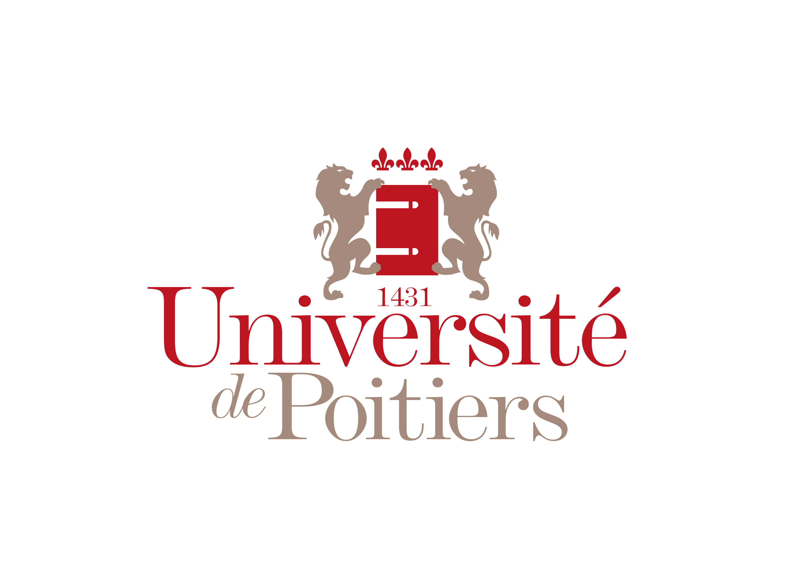

<p align="center">
	
	
	
</p>


# 🏗️ Tour de Hanoï – Intelligence Artificielle & Simulation

## 📑 Table des matières

- [🏗️ Tour de Hanoï – Intelligence Artificielle \& Simulation](#️-tour-de-hanoï--intelligence-artificielle--simulation)
  - [📑 Table des matières](#-table-des-matières)
- [🇬🇧 Tower of Hanoi – AI \& Simulation](#-tower-of-hanoi--ai--simulation)
  - [📑 Table of Contents](#-table-of-contents)
  - [🚀 Overview](#-overview)
  - [📂 Project Structure](#-project-structure)
  - [🧩 Main Features](#-main-features)
  - [🛠️ Usage](#️-usage)
  - [📖 Code Example](#-code-example)
  - [📖 Code Example](#-code-example-1)
  - [🧠 Key Concepts](#-key-concepts)
  - [✨ Customization](#-customization)
  - [👨‍💻 Author](#-author)
  - [📜 License](#-license)
  - [✨ Personnalisation](#-personnalisation)
# 🇬🇧 Tower of Hanoi – AI & Simulation

<details>
<summary>Click to expand English version</summary>

<p align="center">
	
	
	
</p>

## 📑 Table of Contents

- [🏗️ Tour de Hanoï – Intelligence Artificielle \& Simulation](#️-tour-de-hanoï--intelligence-artificielle--simulation)
  - [📑 Table des matières](#-table-des-matières)
- [🇬🇧 Tower of Hanoi – AI \& Simulation](#-tower-of-hanoi--ai--simulation)
  - [📑 Table of Contents](#-table-of-contents)
  - [🚀 Overview](#-overview)
  - [📂 Project Structure](#-project-structure)
  - [🧩 Main Features](#-main-features)
  - [🛠️ Usage](#️-usage)
  - [📖 Code Example](#-code-example)
  - [📖 Code Example](#-code-example-1)
  - [🧠 Key Concepts](#-key-concepts)
  - [✨ Customization](#-customization)
  - [👨‍💻 Author](#-author)
  - [📜 License](#-license)
  - [✨ Personnalisation](#-personnalisation)

## 🚀 Overview

This project offers a complete simulation and automatic solver for the classic Tower of Hanoi puzzle, featuring:
- An efficient data structure to represent the game state
- Utility functions for manipulation and analysis
- An automatic solving algorithm with step-by-step tracing
- Beautiful console output to visualize the game

## 📂 Project Structure

```
Hanoi/
│
├── JeuHanoi.py         # Main class for game management and display
├── utils.py            # Utility functions (rules, situations, moves...)
├── main.py             # Main script: automatic solving and display
├── README.md           # This file!
└── ...                 # (tests, notebooks, etc.)
```

## 🧩 Main Features

- **Faithful simulation** of the Tower of Hanoi (3 pegs, 3 disks)
- **Readable and aesthetic console display** of each state
- **Detection of already encountered situations** to avoid cycles
- **Strict rule enforcement** (no larger disk on a smaller one)
- **Move history** and step count

## 🛠️ Usage

1. **Install dependencies**

Only `numpy` is required (usually included in scientific Python distributions):

```bash
pip install numpy
```

2. **Run the simulation**

In the project folder, run:

```bash
python main.py
```

You will see each step of the solution, with the game state after every move.

## 📖 Code Example

```python
from JeuHanoi import JeuHanoi
from utils import *
# 🇬🇧 Tower of Hanoi – AI & Simulation

<p align="center">
  
  
  
</p>

## 📑 Table of Contents

- [Overview](#-overview)
- [Project Structure](#-project-structure)
- [Main Features](#-main-features)
- [Usage](#-usage)
- [Code Example](#-code-example)
- [Key Concepts](#-key-concepts)
- [Customization](#-customization)
- [Author](#-author)
- [License](#-license)

## � Overview

This project offers a complete simulation and automatic solver for the classic Tower of Hanoi puzzle, featuring:
- An efficient data structure to represent the game state
- Utility functions for manipulation and analysis
- An automatic solving algorithm with step-by-step tracing
- Beautiful console output to visualize the game

## 📂 Project Structure

```
Hanoi/
│
├── JeuHanoi.py         # Main class for game management and display
├── utils.py            # Utility functions (rules, situations, moves...)
├── main.py             # Main script: automatic solving and display
├── README.md           # This file!
└── ...                 # (tests, notebooks, etc.)
```

## 🧩 Main Features

- **Faithful simulation** of the Tower of Hanoi (3 pegs, 3 disks)
- **Readable and aesthetic console display** of each state
- **Detection of already encountered situations** to avoid cycles
- **Strict rule enforcement** (no larger disk on a smaller one)
- **Move history** and step count

## 🛠️ Usage

1. **Install dependencies**

Only `numpy` is required (usually included in scientific Python distributions):

```bash
pip install numpy
```

2. **Run the simulation**

In the project folder, run:

```bash
python main.py
```

You will see each step of the solution, with the game state after every move.

## 📖 Code Example

```python
from JeuHanoi import JeuHanoi
from utils import *

jeu = JeuHanoi()
jeu.nombre_palet[0] = 3
jeu.pic[0,0] = 3
jeu.pic[0,1] = 2
jeu.pic[0,2] = 1
jeu.printJeu()
```

## 🧠 Key Concepts

- **Binary encoding of situations** for fast duplicate detection
- **Move simulation** on copies to test validity
- **Clear separation** between game logic and utilities

## ✨ Customization

You can easily:
- Change the number of disks (adapt the class and utilities)
- Change the rule order in `main.py` to explore other strategies
- Add tests or visualizations

## 👨‍💻 Author

Mikael Pecyna  
Master 2 – Machine Learning  
Université de Lille

## 📜 License

Academic project – free to use and modify for educational purposes.
## ✨ Personnalisation
